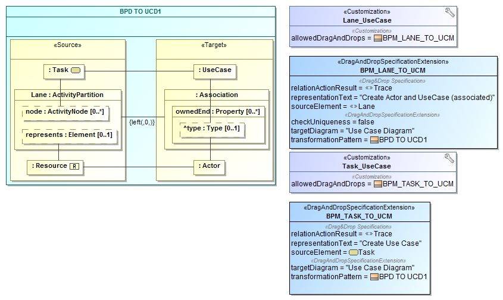

## Plugin description

Drag and Drop Transformations plug-in for MagicDraw UML provides the development environment for model-driven development of Model-to-Model (M2M) transformations and their processing. This plugin is being developed at the Center of Information System Design Technologies at the Department of Informatics, Kaunas University of Technology

The developed solution for model-based partial M2M transformations is composed of six core components:

* CASE tool MagicDraw as the implementation platform for our approach. The CASE tool supports recent versions of various OMG modeling standards, including UML 2.5 and Business Process Modeling Notation (BPMN) 2.0. It also supports UML profiles, as well as provides facilities for development of customizations and domain specific languages (DSLs). Custom plug-ins can be developed in Java language using internal Open API.
* DSL engine which provides functionality to use domain specific profiles as customized UML extensions for development of customized diagrams with user-defined toolbars, stereotyped elements, symbol styles, customization of element specifications and representations, application of custom real-time semantic rules. All DSL customizations in the MagicDraw are stored as UML models.
* MagicDraw Model Profiles package with native MagicDraw UML profiles, which are mandatory for the development and execution of D&D M2M transformations.
* Custom Transformation Libraries component, which stores custom M2M transformation specifications (models) for specific modeling languages, e.g. UML, BPMN, SBVR, UML-BPMN, BPMN-SBVR, UML-SBVR.
* VEPSEM model integration plug-in for MagicDraw UML (optional), which provides model integration capability. VEPSEM Model Transformation Plugin is another tool, developed by VEPSEM research group in the Information Systems Department, Kaunas University of Technology. Current version is available at http://isd.ktu.lt/failai/vepsem/vepsem_plugin.zip.

The D&D M2M Transformations plug-in is developed using M2M Transformations Core API, which implements all the necessary abstract M2M transformation processing and could be used to develop other similar M2M transformation solutions for other compatible CASE tools. Such development solution enables its reuse and integration of the developed transformation engine, while at the same time providing flexibility and extendability essential for custom implementations.

Two relevant UML profiles are created and distributed with the D&D M2M Transformations plugin:

* M2M Transformations profile, which contains the transformation metamodel and other related elements, such as Customization elements used by MagicDraw DSL engine to customize the representations of model elements.
* Model Integration profile, containing UML elements and custom stereotypes used to provide the required model integration capability.

One of the core features of this approach is custom transformation libraries, developed for different modeling languages or their sets, which contain model-based partial M2M transformation specifications (models). The libraries can be developed and exchanged among MagicDraw UML users, provided they have installed the D&D M2M Transformations plugin in their MagicDraw UML tools. A MagicDraw UML project may use more than one transformation library at the same time, depending on particular needs of a user.

Two additional native MagicDraw profiles (from `MagicDraw Model Profiles` package) are required to run this solution:

* DSL Customization profile (distributed together with MagicDraw UML), which is used by the transformation engine and provides a set of necessary stereotypes.
* UML Metamodel with attributes (can be installed as a resource using MagicDraw Resource/Plugin Manager), which is used to represent UML metaclasses together with their properties. This is mandatory for the development of transformation patterns.

The current version of the plugin can be downloaded  from [here](https://www.dropbox.com/s/707c8wukki4yclv/dnd_plugin_no_SBVR.zip?dl=0) (this version does not include SBVR profile and sample libraries for transformations of from/to SBVR elements) and from [here](https://www.dropbox.com/s/qoj0a6ecyjj9jlz/dnd_plugin_SBVR.zip?dl=0) (including SBVR transformation libraries and customizations). Note, that these are still alpha versions, and functionality is still under development, thus it is not expected to work in every situation. The solution has curently been tested with UML (Use Case, Class, State Machine models), BPMN process model, SoaML models and SBVR Fact model.

## Examples and use

An example specification is shown below. It uses simple visual transformation definition language, which is used to define transformation relationships (connections) between source and target elements. The full reference for their development is still under under development.

And these are demos of how this technology works in practice: [create transformation specification](https://www.youtube.com/watch?v=mp0WWO9McII) and [use it in practice](https://www.youtube.com/watch?v=hJYwziNGa9I)

## Installation

Both D&D Transformations plugin and VEPSEM plugin can be installed using MagicDraw UML Plugin Manager (`Help` -> `Resource/Plugin Manager` and selecting `Import` button). All the relevant resources are included in these packages. Currently, only MagicDraw UML 18.1 version is supported, due to changes in MagicDraw Open API and its testing framework.

## Known bugs

The plugin may not work after closing and opening another project. This is a bug, related to MagicDraw UML behavior. Hence, MagicDraw UML should be restarted to start using the plugin again.

## References

1. Skersys T., Danenas P., Butleris R. Model-based M2M Transformations based on Drag-andDrop Actions: Approach and Implementation. Journal of Systems and Software (2016), Vol.122, pp. 327–341.
2. Skersys, T., Danenas, P. Pavalkis, S. Model-driven development of partial model-to-model transformations in a CASE tool. International Conference of Numerical Analysis and Applied Mathematics 2015 (ICNAAM 2015), AIP Conference Proceedings, Vol. 1738, 240005 (2016).
3. Skersys, T., Pavalkis, S., Lagzdinyte-Budnike, I. Model-driven approach and implementation of partial model-to-model transformations in a CASE tool. Proceedings of Information and software technologies: 20th international conference, ICIST 2014, Druskininkai, Lithuania, October 9-10, 2014, pp. 260-271.
